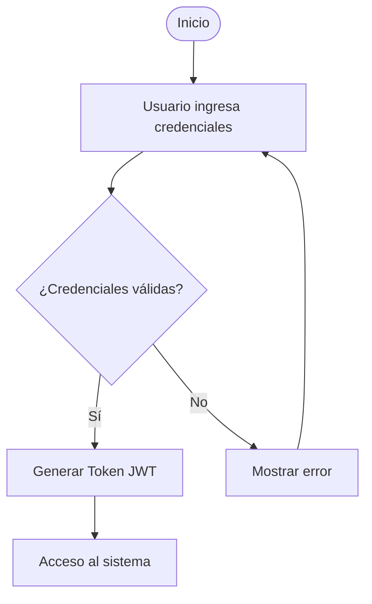

# TRABAJO PRÁCTICO – UNIDAD 5
## Gestión de artefactos, Docs-as-Code y redacción técnica

**Materia:** Gestión de Desarrollos de Software  
**Unidad 5:** Artefactos técnicos y documentación automatizada  
**Alumno:** Nicolás Viruel

---

## Caso: TechGuard – AuthService

TechGuard desarrolla **AuthService**, una API de autenticación y gestión de usuarios. El equipo anterior dejó código desorganizado, documentación en Word/PDF desactualizada (*documentation drift*) y diagramas en PNG difíciles de mantener. La dirección reorganiza el repositorio, adopta **Docs-as-Code** e incorpora IA generativa para acelerar manuales y diagramas, con revisión humana.

---

## 1. Organización de artefactos y principios de documentación

### Estructura de carpetas

| Artefacto | Carpeta / ubicación | Justificación breve |
|-----------|---------------------|---------------------|
| Archivo `.env.example` | `config/` | Plantilla de configuración (variables de entorno) sin secretos; va junto al resto de archivos de configuración del servicio. |
| Capturas de pantalla para el manual | `assets/` | Recursos estáticos (imágenes) reutilizables en documentación y manuales. |
| Código fuente de controladores de autenticación | `src/` | Código fuente del sistema (capa de aplicación/API). |
| Pruebas unitarias / de integración | `tests/` | Pruebas automatizadas del sistema, separadas del código productivo. |
| Especificación técnica en Markdown | `docs/` | Documentación técnica versionada junto al proyecto (Docs-as-Code). |
| Información general del proyecto | `README.md` (raíz) | Punto de entrada: qué es AuthService, cómo clonar, requisitos y enlaces a `docs/`. |

### Las “4 C” de la buena documentación y el README principal

| Principio | Significado | Aplicación al `README.md` de AuthService |
|-----------|-------------|------------------------------------------|
| **Clara** | Lenguaje directo, sin ambigüedades. | Título del proyecto, propósito de la API y audiencia (desarrolladores/ops) en el primer párrafo. |
| **Concisa** | Solo lo necesario para orientar. | Secciones cortas: requisitos, instalación rápida, enlace a `docs/` para detalle; evitar pegar toda la arquitectura en el README. |
| **Correcta** | Alineada con la versión actual del código. | Indicar versión o rama estable, comandos probados (`docker compose up`, variables en `config/.env.example`) y actualizar el README en el mismo PR que cambie el setup. |
| **Completa** | Cubre lo mínimo para arrancar sin adivinar. | Incluir prerequisitos (Node/Java, PostgreSQL), cómo correr tests, contacto o enlace al manual técnico y política de contribución (PR + revisión). |

---

## 2. Comparativa: documentación tradicional vs. Docs-as-Code (AuthService)

| Aspecto | Documentación tradicional | Enfoque Docs-as-Code |
|---------|---------------------------|----------------------|
| ¿Dónde se escribe/almacena? | Archivos Word/PDF o wikis externas separadas del repositorio. | En el mismo repositorio Git (`docs/`, `README.md`, diagramas en Markdown/Mermaid). |
| Control de versiones | Versiones manuales (“Informe_v3_final.docx”), carpetas compartidas o wiki sin trazabilidad unificada con el código. | Registro mediante Git (commits, historial, autor, diff por línea). |
| Revisión de cambios | Comentarios manuales o envíos por correo; difícil ver qué cambió entre versiones. | **Pull Requests**: revisión por pares, comentarios inline y aprobación antes de merge. |
| Publicación | Exportar PDF/HTML y subir manualmente a intranet, drive o wiki. | Automática mediante pipeline **CI/CD** tras cada merge (p. ej. sitio estático desde `docs/`). |
| Formato del archivo | Binario / procesador de texto (DOCX, PDF). | Texto plano (**Markdown**), diagramas como código (**Mermaid**), diffs legibles en Git. |

---

## 3. Diagramación como código (Mermaid.js) y mantenibilidad

### Documentation drift y diagramas en imagen

**Documentation drift** es la desviación entre lo que el sistema **hace hoy** y lo que la documentación **dice** que hace. Ocurre cuando el código evoluciona pero los Word/PDF/PNG no se actualizan al mismo ritmo.

Los diagramas en **PNG/JPG** favorecen el drift porque: (1) no se versionan de forma textual en Git (cambios opacos, diffs inútiles); (2) editarlos exige herramientas gráficas y exportación manual; (3) suele nadie “ser dueño” de actualizar la imagen tras un cambio en el flujo de login o en la API.

### Proceso de inicio de sesión (Mermaid – `flowchart TD`)

### Pull Requests y diagrama en texto plano

Al guardar el diagrama como **texto** en el repositorio, Git muestra **diffs** claros en cada PR (“agregamos rama de bloqueo por intentos fallidos”). Los revisores pueden comprobar que el flujo documentado coincide con el merge de código de AuthService, comentar la sintaxis Mermaid y exigir actualización documental antes de aprobar, igual que con el código.

---

## 4. Manuales, instructivos y tipología

| Escenario | Tipo de documento | Motivo |
|-----------|-------------------|--------|
| Nuevo desarrollador: entorno local y base de datos | **Manual de instalación** | Paso a paso para dependencias, variables, migraciones y primer arranque en máquina de desarrollo. |
| Administrador de sistemas: arquitectura, BD y endpoints | **Manual técnico** | Describe componentes, esquemas, contratos de API, despliegue y operación; audiencia especializada. |
| Cliente final: navegación y tareas cotidianas | **Manual de usuario** | Lenguaje simple, orientado a tareas (“cómo iniciar sesión”, “cómo restablecer contraseña”), sin detalle de implementación. |

---

## 5. Redacción generativa y automatización con IA

### Integración de IA en el pipeline Docs-as-Code

Dentro del flujo **Docs-as-Code**, la IA generativa suele usarse en etapas **asistidas** del pipeline: (1) a partir de descripciones en lenguaje natural o del propio código/OpenAPI, el modelo propone **borradores** de secciones de manual o **código Mermaid**; (2) el desarrollador revisa, corrige y commitea en una rama; (3) el **PR** dispara revisión humana; (4) tras el merge, el **CI/CD** publica la documentación actualizada. Así la IA acelera el borrador, pero la fuente de verdad sigue siendo el repositorio versionado.

### Beneficio y riesgo sin supervisión humana (*human-in-the-loop*)

| | Detalle |
|---|--------|
| **Beneficio clave** | **Velocidad y cobertura inicial**: primeras versiones de manuales, POEs o diagramas en minutos, liberando tiempo del equipo para validar y refinar. |
| **Limitación / riesgo** | **Alucinaciones y desactualización**: la IA puede inventar endpoints, permisos o pasos de instalación incorrectos. Sin revisión experta, se **formaliza documentación errónea** y se agrava el *documentation drift*, con impacto en seguridad (AuthService) y operación. |

---
