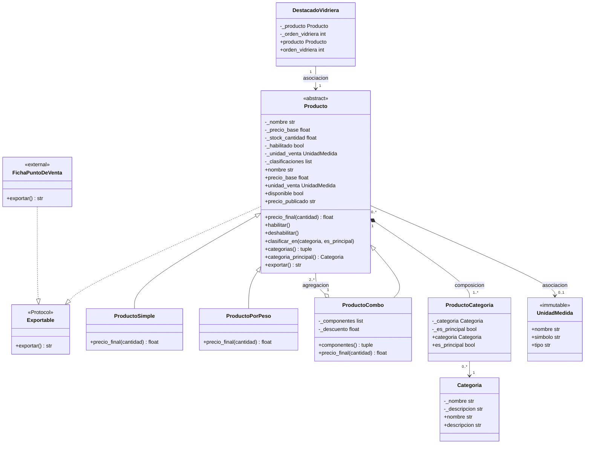

# Diagrama UML final — Food Store

Decisión R3: **ProductoDestacado no hereda de Producto**. Se reemplaza por `DestacadoVidriera`, que asocia cualquier `Producto` con un orden de vidriera. Un producto destacado no es otro tipo de producto: es el mismo producto con metadata promocional.

