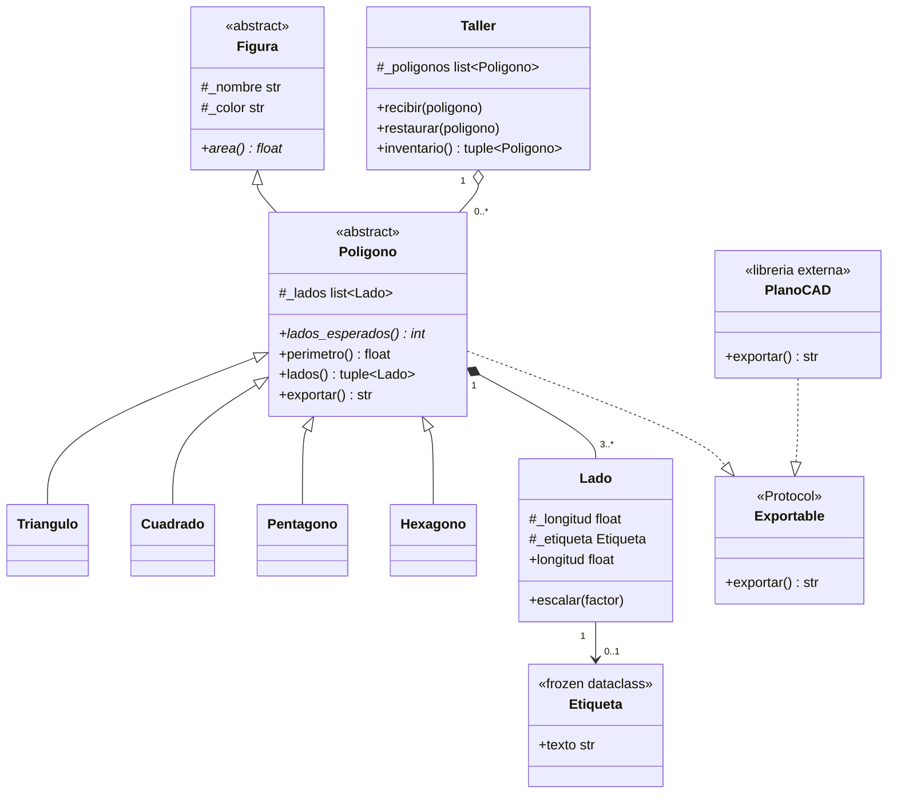

```mermaid
classDiagram
    class Exportable {
        <<Protocol>>
        +exportar() str
    }
    class Figura {
        <<abstract>>
        #_nombre str
        #_color str
        +area()* float
    }
    class Poligono {
        <<abstract>>
        #_lados list~Lado~
        +lados_esperados()* int
        +perimetro() float
        +lados() tuple~Lado~
        +exportar() str
    }
    class Lado {
        #_longitud float
        #_etiqueta Etiqueta
        +longitud float
        +escalar(factor)
    }
    class Etiqueta {
        <<frozen dataclass>>
        +texto str
    }
    class Taller {
        #_poligonos list~Poligono~
        +recibir(poligono)
        +restaurar(poligono)
        +inventario() tuple~Poligono~
    }
    class Triangulo
    class Cuadrado
    class Pentagono
    class Hexagono
    class PlanoCAD {
        <<libreria externa>>
        +exportar() str
    }
    Figura <|-- Poligono
    Poligono <|-- Triangulo
    Poligono <|-- Cuadrado
    Poligono <|-- Pentagono
    Poligono <|-- Hexagono
    Poligono "1" *-- "3..*" Lado
    Lado "1" --> "0..1" Etiqueta
    Taller "1" o-- "0..*" Poligono
    Poligono ..|> Exportable
    PlanoCAD ..|> Exportable
```
