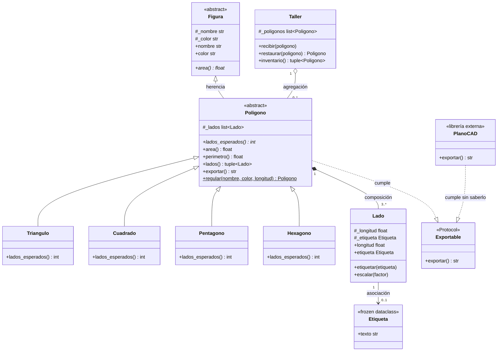

# Diagrama UML final — Solución de referencia

Refleja las decisiones de las Partes 3 y 4: **`PoligonoRegular` ya no existe como clase**
(se reemplazó por el `@classmethod regular(...)`), y `Exportable` es un `Protocol` que
`Poligono` y `PlanoCAD` cumplen —este último sin heredar de nada.

Pegá el bloque en https://mermaid.live para verlo renderizado.

## Coherencia diagrama ↔ código

- `Poligono` es abstracta (`ABC`) y su único abstracto es `lados_esperados()`; `area()`
  es un método **concreto** heredado por todas las subclases.
- La composición `*--` se implementa fabricando los `Lado` dentro del constructor de
  `Poligono`; la agregación `o--` se implementa recibiéndolos ya hechos en `Taller`.
- No aparece `PoligonoRegular`: quedó como el constructor de clase `Poligono.regular(...)`.
